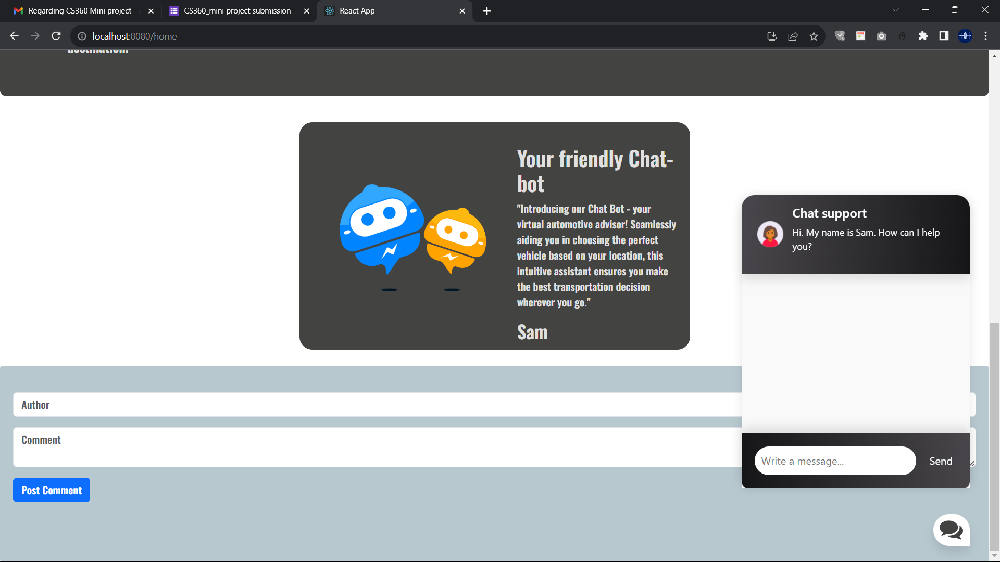
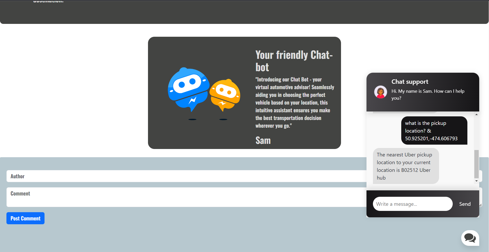

# TaxiBot: Streamlined Taxi Service Locator

TaxiBot is a comprehensive solution designed to simplify the process of finding and using taxi services. It leverages modern web technologies and machine learning algorithms to provide users with a seamless experience in locating and utilizing taxi services efficiently.

## Features

### Frontend
- **React**: The frontend is built using React, a powerful JavaScript library for building user interfaces. This ensures a dynamic and responsive user experience.

### Backend
- **Node.js**: The server-side is powered by Node.js, enabling fast and scalable network applications.
- **Python Flask**: The backend for the chatbot is built with Python Flask, a lightweight WSGI web application framework. This allows for easy integration of the chatbot and efficient handling of user requests.

### Chatbot
- **Custom-built**: The chatbot was developed from scratch, ensuring it meets the specific needs of our application.
- **Multilayer Neural Network**: Utilizes a multilayer neural network with ReLU (Rectified Linear Unit) activation function to process and understand user queries.
- **K-Cluster Algorithm**: Implements the K-Cluster algorithm for clustering the hub locations, optimized using Uber data for accurate and efficient service clustering.

## Screenshots

### Frontend


### Chatbot


### chatbot with K-Cluster Algorithm


## Installation

To set up the project locally, follow these steps:

1. **Clone the Repository:**
   ```bash
   git clone https://github.com/Big-Leu/ml-image.git
   cd taxibot
1. **how to start frontend/backen:**
   ```bash
   cd frontend
   npm i
   npm run build 
   node app.js

1. **how to start frontend/backen using the docker:**
   ```bash
   cd frontend
   docker-compose up -d --build

1. **how to start backend of the chatbot:**
   ```bash
   pip install -r requirements.txt
   cd backend
   python app.py
